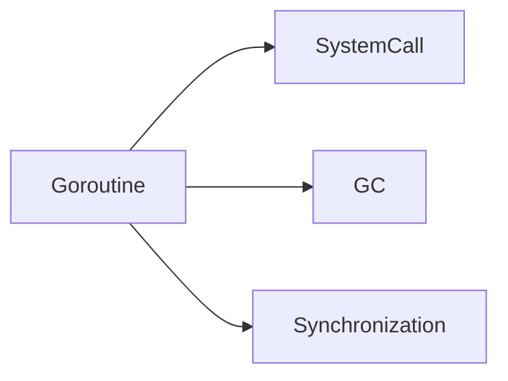
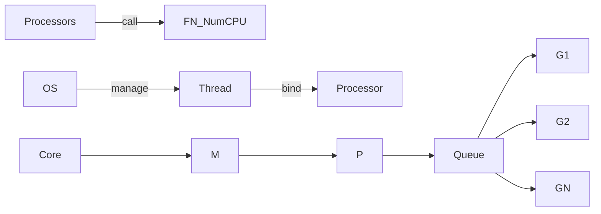
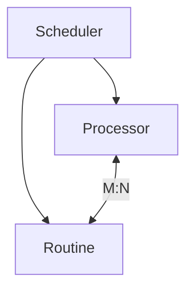
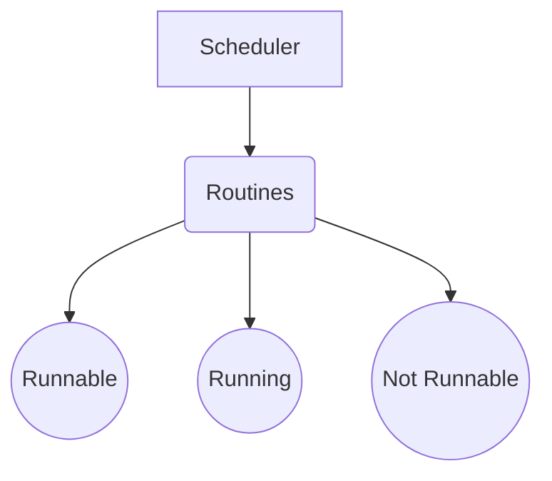

# Go Runtime

```mermaid
flowchart LR
    Goroutine --> SystemCall & GC & Synchronization
```

```mermaid
flowchart LR
    Processors -->|call| FN_NumCPU
    OS -->|manage| Thread -->|bind| Processor
    Core --> M --> P --> Queue --> G1 & G2 & GN
```

```mermaid
flowchart
    a --> b & c
    a[Scheduler]
    b[Processor]
    c[Routine]
    b <-- M:N --> c
```

```mermaid
flowchart
    a --> b --> c & d & e
     a[Scheduler]
     b(Routines)
     c((Runnable))
     d((Running))
     e((Not Runnable))
```
