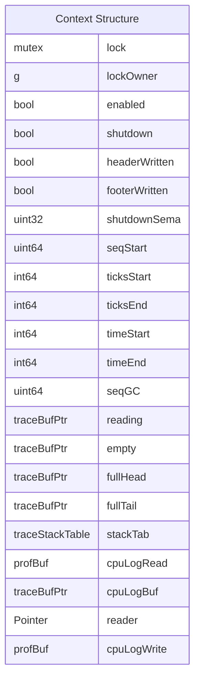
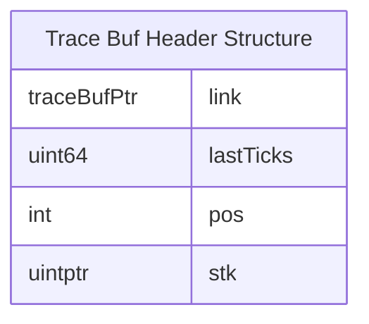

# Trace in Runtime

## Context Model


```mermaid
erDiagram
    "Context Structure" {
        mutex lock 
        g lockOwner
        bool enabled
        bool shutdown
        bool headerWritten
        bool footerWritten
        uint32 shutdownSema
        uint64 seqStart
        int64 ticksStart
        int64 ticksEnd
        int64 timeStart
        int64 timeEnd
        uint64 seqGC
        traceBufPtr reading
        traceBufPtr empty
        traceBufPtr fullHead
        traceBufPtr fullTail
        traceStackTable stackTab
        profBuf cpuLogRead
        traceBufPtr cpuLogBuf
        Pointer reader
        profBuf cpuLogWrite 
    }
```

```mermaid
erDiagram
    "Trace Buf Header Structure" {
        traceBufPtr link
        uint64 lastTicks
        int pos
        uintptr stk
    }
```
```mermaid

```
